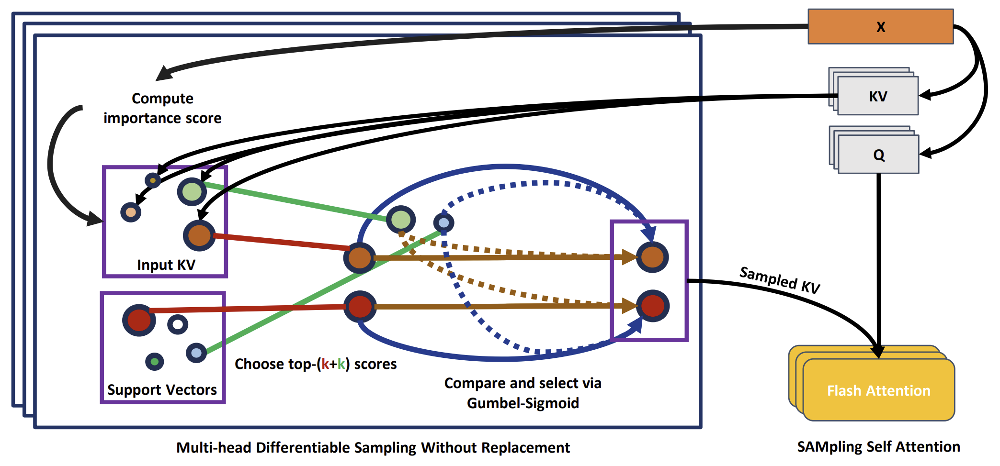

# Many Data Modality Architecture Research Framework

https://arxiv.org/pdf/2408.05391.pdf



## Description
The **Many Data Modality Architecture Research Framework** is a research-oriented project designed to facilitate efficient transformer-based research across a variety of data modalities. This framework is equipped with pre-implemented benchmarks for data types such as point clouds, graphs, and sequences, enabling researchers to focus on developing and testing new models.

## Installation

To get started with the Many Data Modality Architecture Research Framework, you'll need the following dependencies:

```bash
# Install PyTorch (version 2.4+ required)
pip install torch torchvision torchaudio --index-url https://download.pytorch.org/whl/cu124

# Install Flash Attention (For sliding window Attention if needed)
pip install flash-attn --no-build-isolation

# Warm-up, Timm (For DropPath), other common ML libraries
pip install pytorch-warmup timm numpy matplotlib

# Install dataset-specific libraries (highly dependent on use-case)
# Example: For graph data
pip install torch-geometric
pip install nuscenes-devkit
```

# For other data modalities, install relevant libraries as needed.

## Usage
- We work on two levels: DL Python Module Implementations (implementations of control flows, layers, optimizers, schedulers, \dots) and Experiment files (flow of tensors, hyperparameters, \dots)
- The experiment file defines high level things: how the tensor flows from loaders to prediction results/loss computation and hyperparameters (what optimizers, schedulers, ...)
- The Python Implementations are meant to be small, consise, and reusable. (e.g. implementation of transformer layer, implementation of dataset modules, ...)
- The Python Implementations also includes specific experiments. We will work to simplify this into an unified parser working across all datasets, with more diverse optimization scheme

### Module
- Modules are implemented in
- Modules receive a Python dictionary of tensors and output a Python dictionary of tensors

## License
This project is licensed under the MIT License 

## Contact Information
For support, questions, or to report issues, please open an issue on GitHub or reach out on Discord: flily914 (I'll always be there, expect some hours delay).

## Please cite our work

```bibtex
@misc{lenhat2024samsaefficienttransformerdata,
      title={SAMSA: Efficient Transformer for Many Data Modalities}, 
      author={Minh Lenhat and Viet Anh Nguyen and Khoa Nguyen and Duong Duc Hieu and Dao Huu Hung and Truong Son Hy},
      year={2024},
      eprint={2408.05391},
      archivePrefix={arXiv},
      primaryClass={cs.LG},
      url={https://arxiv.org/abs/2408.05391}, 
}
```
